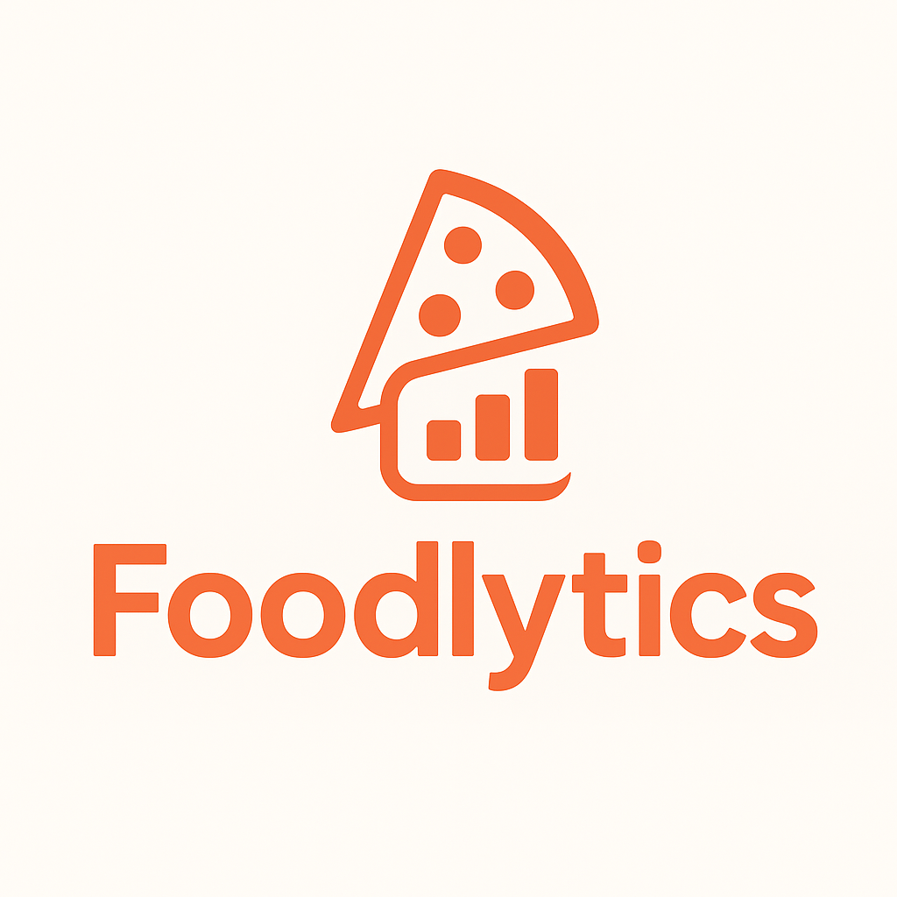

# FECAP - Fundação de Comércio Álvares Penteado

<p align="center">
<a href= "https://www.fecap.br/"></a>
</p>

# Nome do Projeto: Foodlytics

## Grupo Foodlytics

## **Integrantes:** [Leonardo Ferreira](https://www.linkedin.com/in/leoonaardoferreira/) e [Maria Kassandra Gomes](https://www.linkedin.com/in/maria-kassandra-a-a6b406284)
## **Professores Orientadores:** [Victor Bruno Alexander Rosetti de Quiroz](https://www.linkedin.com/in/victorbarq/), [Rafael Diogo Rossetti](https://www.linkedin.com/in/rafael-diogo-rossetti/), [Marcos Minoru Nakatsugawa](https://www.linkedin.com/in/marcosminorunakatsugawa/), [Rodrigo da Rosa](https://www.linkedin.com/in/rodrigo-da-rosa-phd/), [Renata Muniz do Nascimento](https://www.linkedin.com/in/remuniz/)

## Descrição

<p align="center">

</p>

Há dificuldade em demonstrar aos clientes diretos — restaurantes, esfiharias e pizzarias — o impacto positivo da Cannoli em seus negócios. As ofertas comerciais enviadas hoje não apresentam correlações claras entre campanhas e aumento real de pedidos finalizados.

Trabalhamos com bases semicolon e múltiplos relatórios no Kit de Dados Cannoli; contudo, os dados estavam dispersos, pouco visuais e sem rastreabilidade. O Foodlytics surge para organizar essa inteligência e transformar negociações em argumentos embasados.

## Principais funcionalidades do painel

- **Filtros e contexto**: período, canais e badges com botões de exportação.
- **KPIs e visualizações**: receita, pedidos, ticket médio, cancelamentos, tempo médio de preparo, séries temporais e distribuição por canal.
- **Alertas e sugestões automáticas**: detecção de variações diárias acima de 15% e recomendações imediatas para o time comercial.
- **Exportação pronta para entrega**: relatórios CSV/Excel gerados diretamente no dashboard.
- **Governança de dados**: normalização de datas, valores e status, com cache para ganho de performance.

## 🛠 Estrutura de pastas

```
.
├── assets/
│   └── estilos.css
├── dados/
│   └── brutos/
│       ├── Campaign_semicolon.csv
│       ├── CampaignQueue_semicolon.csv
│       ├── Customer_semicolon.csv
│       └── Order_semicolon.csv
├── documentos/
│   ├── Entrega 1/
│   │   ├── Álgebra Linear, Vetores e Geometria Analítica
│   │   ├── Inteligência Artificial e Aprendizagem de Máquina
│   │   ├── Projeto Interdisciplinar Inteligência Artificial
│   │   ├── Psicologia, Liderança e Soft Skills
│   │   └── Sistemas Operacionais e Computação em Nuvem
│   ├── Entrega 2/
│   │   ├── Álgebra Linear, Vetores e Geometria Analítica/
│   │   │   └── Relatorio_Entrega2.pdf
│   │   ├── Inteligência Artificial e Aprendizagem de Máquina/
│   │   │   └── Entrega2_IAML.ipynb
│   │   ├── Psicologia, Liderança e Soft Skills/
│   │   │   └── Entrega 02 - Psicologia, Liderança e Soft Skills-1.pdf
│   │   └── Sistemas Operacionais e Computação em Nuvem/
│   │       ├── Dockerfile
│   │       ├── Entrega 2-Sistemas Operacionais-1.pdf
│   │       ├── meu-nginx/
│   │       │   ├── Dockerfile
│   │       │   ├── Dockerfile.txt
│   │       │   └── index.html
│   │       └── python-app/
│   │           ├── app.py
│   │           ├── app0.py
│   │           ├── Dockerfile
│   │           └── wait-for-db.sh
│   ├── Banner_PI_80x120 - Copiar2.pdf
│   ├── Documento - Projeto de Extensão - COM Empresa.docx
│   └── README.md
├── imagens/
│   ├── logo-laranja.png
│   └── logo.png
├── src/
│   ├── aplicacao.py
│   ├── dados/
│   │   └── carga_dados.py
│   ├── layout/
│   │   ├── componentes.py
│   │   └── callbacks.py
│   └── servicos/
│       ├── indicadores.py
│       └── exportacao.py
└── README.md
```

## 💻 Configuração para Desenvolvimento/como instalar

1. **Pré-requisitos**: Python 3.10+, pip e (opcional) virtualenv.
2. **Baixar/clonar** o projeto e entrar na pasta `Projeto3`.
3. **(Opcional) Criar ambiente virtual**:
   ```powershell
   python -m venv .venv
   .\.venv\Scripts\activate
   ```
4. **Instalar dependências**:
   ```powershell
   pip install -r requirements.txt
   ```
5. **Rodar o dashboard**:
   ```powershell
   python src\aplicacao.py
   ```
6. **Acessar** `http://127.0.0.1:8050` (ou endereço exibido no terminal) e navegar pelos filtros.

Os dados são carregados automaticamente do diretório `dados/brutos`; mantenha a estrutura para evitar erros de caminho.

## 📋 Licença/License
<a href="https://github.com/2025-2-NCC5/Projeto3">Foodlytics</a> © 2025 by <a href="https://github.com/2025-2-NCC5/Projeto3">Foodlytics</a> is licensed under <a href="https://creativecommons.org/licenses/by/4.0/">CC BY 4.0</a>

## 🎓 Referências

Aqui estão as referências usadas no projeto.

1. <https://github.com/iuricode/readme-template>
2. <https://github.com/gabrieldejesus/readme-model>
3. <https://chooser-beta.creativecommons.org/>
4. <https://github.com/iuricode/readme-template>
5. <https://github.com/gabrieldejesus/readme-model>
6. <https://plotly.com/python/>
7. <https://dash.plotly.com/>
8. <https://pandas.pydata.org/>
